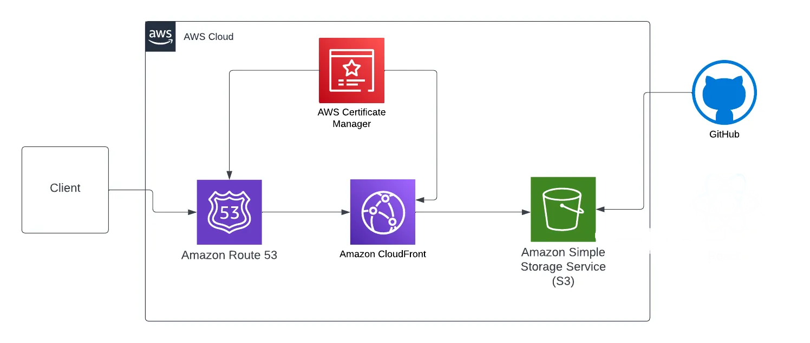

# AWS Cloud Resume Challenge

## Proje Hakkında
Bu projede, AWS servisleri kullanarak modern, güvenli ve ölçeklenebilir bir özgeçmiş web sitesi oluşturdum. Tüm altyapı "Infrastructure as Code" prensibi ile yapılandırıldı ve CI/CD pipeline ile otomatize edildi.

## Kullanılan Teknolojiler
- **Frontend**: HTML, CSS, JavaScript
- **Barındırma**: AWS S3 (Statik web sitesi barındırma)
- **CDN**: Amazon CloudFront
- **DNS Yönetimi**: Amazon Route 53
- **CI/CD**: GitHub Actions

## Proje Mimarisi

## Projede Gerçekleştirilen Adımlar
1. **Statik Web Sitesi Oluşturma**
   - Modern ve responsive bir özgeçmiş sitesi tasarımı
   - HTML5, CSS3 ve vanilla JavaScript kullanımı

2. **AWS S3 Konfigürasyonu**
   - S3 bucket oluşturma ve statik web sitesi barındırma için yapılandırma
   - Uygun erişim politikalarının belirlenmesi

3. **CloudFront Dağıtımı**
   - Global içerik dağıtım ağı kurulumu
   - SSL/TLS sertifikası ile güvenli HTTPS bağlantısı sağlama
   - Edge locations üzerinden düşük gecikme süresi elde etme

4. **Route 53 DNS Yapılandırması**
   - Özel domain adı (izzetaydin.net) satın alınması ve yapılandırılması
   - DNS kayıtlarının oluşturulması ve CloudFront dağıtımına yönlendirilmesi

5. **CI/CD Pipeline Kurulumu**
   - GitHub Actions ile otomatik dağıtım workflow'u oluşturma
   - Her commit sonrası otomatik test ve deployment sağlama

## Demo
Canlı demo: [izzetaydin.net](https://izzetaydin.net)

## Öğrenilen Dersler ve Zorluklar
- CloudFront dağıtımı sırasında cache invalidation stratejilerini yönetmek
- GitHub Actions ile AWS servislerine güvenli erişim için IAM politikalarını yapılandırmak
- DNS propagasyonu süreçlerini yönetmek

## Gelecek Geliştirmeler
- Terraform veya AWS CDK ile IaC yapısını güçlendirmek
- DynamoDB ve Lambda ile ziyaretçi sayacı eklemek
- CI/CD pipeline'a otomatik test eklemek

## Kaynaklar
- [Cloud Resume Challenge](https://cloudresumechallenge.dev/)
- [AWS Documentation](https://docs.aws.amazon.com/)

## İletişim
- LinkedIn: [İzzet Aydın](https://linkedin.com/in/izzet-aydın-556087203/)
- Email: mail@izzetaydin.net
